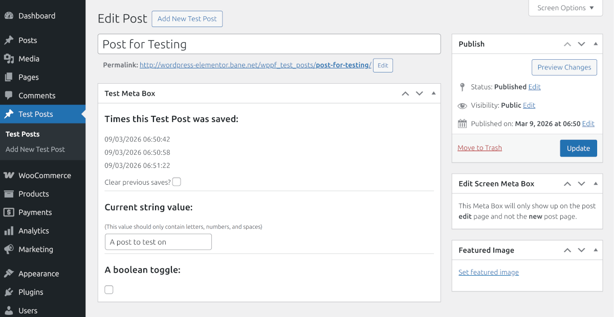
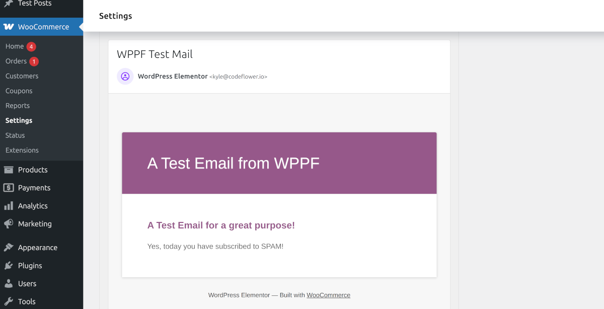

# WPPF Test Plugin

WPPF Test Plugin is a small demonstration plugin and reference implementation built on top of the [WordPress Plugin Framework](https://github.com/kyle-niemiec/wp-plugin-framework). It shows how to structure a plugin around framework modules, custom post types, post meta schemas, WooCommerce email integration, and versioned upgrade routines.

## Reference Implementation

This repository serves as the **reference implementation for the WordPress Plugin Framework (WPPF)**.

If you're learning how to structure a plugin using WPPF, this project demonstrates the recommended conventions for:

- plugin bootstrapping
- module discovery
- custom post types
- structured post meta with validation
- WooCommerce integration
- upgrade routines

For the framework itself, see:

https://github.com/kyle-niemiec/wp-plugin-framework

## What it does

- Registers a custom post type named `Test Posts` (`wppf_test_posts`)
    - Adds a primary meta box for managing structured post meta on that post type
    - Validates meta values through a schema before saving
    - Tracks save timestamps for each test post
    - Adds a side meta box on the edit screen only
- Registers a WooCommerce email class for a test email template
- Includes a sample upgrade schema class
- Adds a staging-detection notice through WPPF

## Requirements

- WordPress
- WooCommerce

This plugin extends `WPPF\v1_2_1\WooCommerce\WooCommerce_Plugin`, so WooCommerce must be installed in order to enable it.

## Installation

1. Download the [latest release](https://github.com/kyle-niemiec/wppf-test-plugin/releases/latest) ZIP file of the WPPF Test Plugin
2. Install the plugin through the "Add Plugin" page in WordPress.
3. Activate WooCommerce if it is not already active.
4. Activate the `WPPF Test Plugin`.

## Included dependencies

- `kyle-niemiec/wp-plugin-framework`
- `kyle-niemiec/wppf-update-helper`

## Custom post type

The plugin registers a public custom post type:

The post type class can be found here:

- [`includes/post-types/class-wppf-test-post-type.php`](includes/post-types/class-wppf-test-post-type.php)

## Post meta example

Each test post stores structured meta in `_wppf_test_post_data` with the following fields:

- `current_string` — string, validated to letters, numbers, and spaces  
- `is_toggle_active` — boolean toggle  
- `times_saved` — array of Unix timestamps

The schema and export logic live in:

- [`includes/classes/class-designink-test-post-meta.php`](includes/classes/class-designink-test-post-meta.php)

This class demonstrates how WPPF can define **structured post meta with validation rules**.

### Admin meta boxes

The primary meta box demonstrates several common patterns:

- Rendering saved timestamps
- Clearing previous field data
- Editing a validated string field
- Toggling a boolean field
- Appending a new timestamp every time the post is saved

Relevant files:

- [`admin/includes/meta-boxes/class-wppf-test-post-meta-box.php`](admin/includes/meta-boxes/class-wppf-test-post-meta-box.php)
- [`admin/templates/test-post-meta-box-template.php`](admin/templates/test-post-meta-box-template.php)

There is also an **edit-screen-only side meta box** example located in:

- [`admin/includes/meta-boxes/class-wppf-test-post-edit-screen-meta-box.php`](admin/includes/meta-boxes/class-wppf-test-post-edit-screen-meta-box.php)
- [`admin/templates/edit-screen-test-meta-box-template.php`](admin/templates/edit-screen-test-meta-box-template.php)

## WooCommerce test email

The plugin includes a sample WooCommerce email implementation:

The email class and template live in:

- [`includes/emails/class-wppf-test-email.php`](includes/emails/class-wppf-test-email.php)
- [`woocommerce/emails/wppf-test-email.php`](woocommerce/emails/wppf-test-email.php)

The module checks for a `wppf-test-email` query parameter during `init` and triggers the email sender when it is present.

See:

- [`includes/modules/class-wppf-test-module.php`](includes/modules/class-wppf-test-module.php)

## Upgrade example

Versioned upgrade logic is demonstrated here:

- [`includes/upgrades/class-v1.0.3.php`](includes/upgrades/class-v1.0.3.php)

This class registers an upgrade routine for plugin version `1.0.3` and serves as a template for implementing real migration tasks.

## Notes for developers

Important entry points include:

- Main plugin file  
  - [`wppf-test-plugin.php`](wppf-test-plugin.php)

- Admin module  
  - [`admin/wppf-test-plugin-admin.php`](admin/wppf-test-plugin-admin.php)

This repository is intended to be read as a **reference implementation** for WPPF rather than a production plugin.

## WPPF Ecosystem

This project is part of the WPPF ecosystem:

[WordPress Plugin Framework (WPPF)](https://github.com/kyle-niemiec/wp-plugin-framework) – Core plugin architecture framework

[WPPF Test Plugin](https://github.com/kyle-niemiec/wppf-test-plugin) – Example project demonstrating a implementation of a plugin using WPPF.

[WP Plugin Update Server](https://github.com/kyle-niemiec/wp-plugin-update-server) – Self-hosted WordPress plugin update infrastructure with GUI management.

[WPPF Update Helper](https://github.com/kyle-niemiec/wppf-update-helper) – Simple integration layer for the WP Plugin Update Server.

Documentation:

https://wp-plugin-framework.codeflower.io